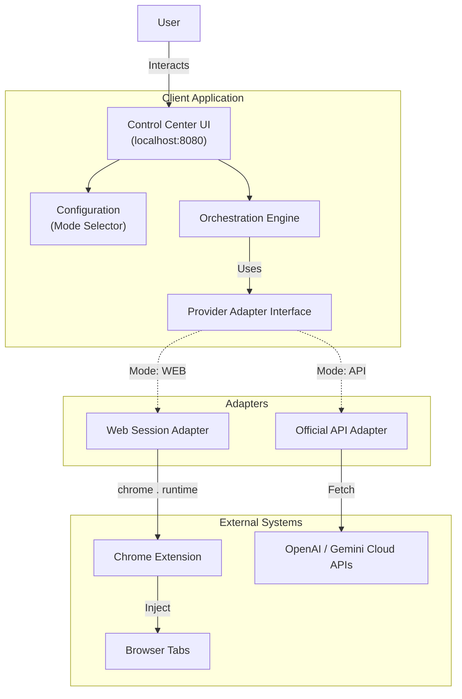

# Design Document: Local AI Orchestrator (Hybrid Edition)

| Metadata           | Details                                                         |
|:-------------------|:----------------------------------------------------------------|
| **Author**         | Kiryl Dubarenka                                                 |
| **Status**         | Draft v2.1 (Refined Architecture)                               |
| **Type**           | Chrome Extension (Manifest V3) + Local Web Client               |
| **Core Principle** | "Bring Your Own Context" (BYOC) via Swappable Provider Adapters |

## 1. Overview

The **AI Orchestrator** is a privacy-first, local-only tool that enables simultaneous collaboration between multiple AI
models.

**v2.0 Update:** This system now supports a **Hybrid Provider Model**. Users can choose the integration method for each
AI independently, abstracting over inconsistent interfaces to provide a unified control plane.

1. **Web Mode (UI Automation):** Controls existing web sessions via Chrome Extension. This mode is strictly used to
   access capabilities currently unique to consumer UIs (e.g., Deep Research, Canvas/Artifacts rendering).
2. **API Mode (Direct):** Connects to official APIs using user-provided keys. This mode is preferred for speed,
   stability, automation, and leveraging Context Caching.

### 1.2 Conceptual Model: Why "Patchbay"?

While the user interface resembles a modern group chat (e.g., Slack, Discord), the core mechanic remains that of a *
***Control Plane**.

* **The Room (Bus):** The unified chat history acts as the main signal bus. All agents share this context, allowing them
  to "hear" each other.
* **The Operator (User):** You are not just a participant; you are the engineer.
* **The Patch Cables (@Targeting):** By using `@AgentName`, you dynamically route the signal (context/prompt) to
  specific processors (AI models). You decide who processes the signal and when.
* **The Processors (Agents):** Each AI model is a specialized unit—one for coding, one for creative writing, one for
  research. You patch them into the signal flow as needed.

### 1.1 Problem Statement

* **Siloed Intelligence:** Lack of interoperability between models.
* **Capability Gap:** Web UIs offer unique features (Deep Research, Canvas) but lack automation. APIs offer automation
  but lack these specific UI capabilities.
* **Solution:** A unified control plane that abstracts the underlying connection method (Web vs. API).

## 2. Goals & Non-Goals

### 2.1 Goals

* **Swappable Backends:** Switch between Web and API modes instantly without losing UI state.
* **Hybrid Workflows:** E.g., Use Gemini via **Web** (for Deep Research) -> Pipe result to ChatGPT via **API** (for Code
  Review).
* **Zero-Backend (Production):** The final orchestration logic resides entirely in the client-side Control Center.
* **Privacy:** API Keys are stored locally. No intermediate servers in the final build.

### 2.2 Non-Goals

* **API Proxying (Production):** We will not ship a local proxy server to hide API keys. Keys are used directly from the
  client (via Extension transport). A temporary proxy is permitted strictly for Phase 1 development.

## 3. System Architecture

The system follows a **Hexagonal Architecture (Ports and Adapters)** on the client side.

* **The Core:** The Control Center UI and Orchestration Logic.
* **The Ports:** AIProvider Interface.
* **The Adapters:**
    * WebAdapter: Communicates with the Chrome Extension.
    * ApiAdapter: Communicates with OpenAI/Google REST APIs.

### 3.1 High-Level Diagram



## 4. Component Design

### 4.1 The Provider Abstraction Layer

To support swappability, the UI will not call specific logic directly. Instead, it interacts with an abstract interface.

**Interface Definition (TypeScript notation for clarity):**

```typescript
interface AIProvider {
    id: string; // 'chatgpt' | 'gemini'
    sendPrompt(text: string, history?: Message[]): Promise<string>;

    getStatus(): Promise<'READY' | 'ERROR' | 'MISSING_KEY'>;
}
```

**Configuration Object:**

```json
{
  "chatgpt": {
    "mode": "API",
    "apiKey": "sk-..",
    "model": "gpt-5"
  },
  "gemini": {
    "mode": "WEB",
    "tabId": null
    // Dynamic
  }
}
```

### 4.2 The Adapters

#### A. The Web Adapter (UI Session)

* **Protocol:** `chrome.runtime.sendMessage` (enabled via `"externally_connectable"` in `manifest.json`).
* **Responsibility:** Formats the prompt into a payload the Extension understands.
* **Nature:** Operates entirely through standard browser interaction mechanisms, similar to accessibility tools and user
  automation.
* **Pros:** Access to "Pro" UI features (Deep Research, Canvas).
* **Cons:** Inherently fragile due to DOM changes; slower latency.

#### B. The API Adapter (Direct)

* **Protocol:** fetch() (REST)
* **Responsibility:** Manages message history array, handles Context Caching headers, parses JSON responses.
* **CORS Handling (Strategy):**
    * *Development (Phase 1-2):* Uses a lightweight local proxy (e.g., Node.js dev server) to bypass browser CORS
      restrictions during initial development.
    * *Production (Phase 3-5):* Swaps the transport layer to utilize the **Chrome Extension Background Worker**. This
      removes the need for the proxy, achieving the "Zero-Backend" goal by delegating network requests to the extension
      context.

### 4.3 Extension Background Service (Updated)

The service worker now has **two** responsibilities:

1. **Router:** Routing messages to Content Scripts (Web Mode).
2. **API Transport:** Acting as a user-initiated fetch relay for API calls (API Mode). This is a stateless transport
   layer; it does not cache or inspect payloads.

## 5. Data Flow (Hybrid Scenario)

### Scenario: "Research with Gemini (Web), Summarize with ChatGPT (API)"

1. **Configuration:** User sets Gemini to **WEB** and ChatGPT to **API**.
2. **Step 1 (Gemini):**
    * User types "Research quantum computing trends" -> Send.
    * Orchestrator selects GeminiWebAdapter.
    * Adapter sends message to Extension -> Injects into gemini.google.com.
    * Gemini (Web) uses its internal "Deep Research" tool.
    * Result scraped from DOM and returned to UI.
3. **Step 2 (Pipe):**
    * User clicks "Share to ChatGPT".
    * UI captures Gemini's text.
4. **Step 3 (ChatGPT):**
    * Orchestrator selects ChatGPTApiAdapter.
    * Adapter constructs JSON payload: {"model": "gpt-5", "messages": [...]}.
    * Adapter sends payload to Extension Background (as Transport).
    * Extension calls https://api.openai.com/v1/chat/completions.
    * Result returned as JSON.
    * **Value:** Efficient "Pay-per-task" execution for the summary, while leveraging the high-value "Deep Research"
      capability from the existing web subscription.

## 6. Security & Privacy

* **Key Storage:**
    * **Primary:** localStorage (scoped to localhost origin). Keys are accessible only to scripts running on the Control
      Center page.
    * **Alternative:** chrome.storage.local (scoped to Extension). This offers better isolation but requires a
      message-passing flow to retrieve keys. For v1, localStorage is sufficient for a local dev tool, provided the user
      trusts their own localhost environment.
* **Least Privilege:**
    * The Extension's host_permissions are strictly scoped to the AI providers (https://api.openai.com/
      *, https://generativelanguage.googleapis.com/*) to allow the Transport layer to function.

## 7. Implementation Roadmap

### Phase 1: API-First Core (Completed)

* **Foundation:** Initialize Local Control Center (Web Client).
* **Engine:** Implement `AIProvider` interface and `Orchestration Engine`.
* **Connectivity:** Develop `ApiAdapter` for standard REST APIs (OpenAI, Gemini).
* **Security:** Build Settings UI for secure local API Key storage.

### Phase 2: Advanced Orchestration (Completed)

* **Context:** Implement Message History and Context Management.
* **Multi-Model:** Enable simultaneous querying of multiple models.
* **Workflows:** Add "Pipe" functionality (Output of Model A -> Input of Model B).

### Phase 3: Collaborative UX (Refinements)

* **Group Chat Model:** Unified Team Chat where all active agents share the same context history.
* **Dynamic Roster (The Hangar):**
    * **Empty by Default:** The Hangar starts empty (or restored from `localStorage`).
    * **Agent Catalog:** The `(+)` button opens a selection menu to add specific AI models to the current session.
    * **Active = Participant:** Any agent visible in the Hangar is considered "Active" and will respond to `@all`.
      Toggles are removed.
    * **Persistence:** The list of session participants is saved to `localStorage` to persist across reloads.
* **Targeting & Autocomplete:**
    * Implement `@AgentName` syntax in the input field.
    * **Scoped Autocomplete:** The `@` suggestions only show agents currently in the Hangar.
    * Special Aliases: `@all` and `@everyone` trigger a broadcast to all Hangar participants.
* **Passive by Default:** Messages without `@mentions` are saved to history without triggering responses.
* **Visual Polish:**
    * **Markdown & Attribution:** Standardized `@Handle` identity system for system prompts and history attribution.
    * **Loading Indicators:** Per-agent "Typing..." states.
    * **Markdown Rendering:** With "Copy Original" functionality.

### Phase 4: Analytics & Optimization

* **Usage Tracking:** Track token usage, request counts, and estimated costs per provider.
* **Performance:** Monitor API latency and response times.
* **Optimization:** Tools for prompt engineering and cost reduction.

### Phase 5: Browser Integration (The Bridge)

* **Extension Setup:** Initialize Chrome Extension (Manifest V3).
* **Transport Layer:** Implement "CORS Transport" in background script to replace the dev proxy.
* **Web Mode:** Develop `WebAdapter` for DOM injection/automation of external Chat UIs.
* **Hybrid:** Enable switching between API and Web modes.
